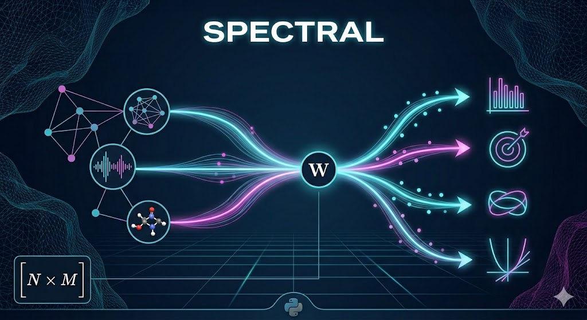

# Spectral Flow Transform

<p align="center">
  <b>One formula. One kernel. All operators.</b><br>
  <sub>From Fourier to non-commutative spectral geometry. From data to operator in one call.</sub>
</p>

<p align="center">
  <code>W(i,j) = v<sub>i</sub><sup>T</sup> · B<sub>j</sub> · v<sub>i</sub> = ∂λ<sub>i</sub>/∂k<sub>j</sub></code>
</p>

<p align="center">
  
</p>

---

## What

**Spectral Flow Transform** is a tiny idea with a big payoff: treat the spectrum as a differentiable object.

Given a linear operator family A(k) = A₀ + Σ kⱼ·Bⱼ, the kernel W captures the entire first-order spectral response:

| Without SFT | With SFT |
|-------------|----------|
| `eigh(A(k))` for every perturbation k — **O(N³) each** | One `eigh` at build → `W·dk` — **O(N·M)** |
| No way to *design* an operator for a target spectrum | `W⁺·(λ_target − λ₀)` — **closed-form inverse** |
| Spectral topology requires custom code | Monodromy, Berry phase, exceptional points — built in |
| Graph Laplacian → spectrum only | spectrum → edge weights via W⁺ — **inverse graph design** |

**W is the spectral Jacobian.** It compresses the response of an operator family into one matrix. Prediction, inverse design, topology, Hessian, invariants, codecs, graph tools, and domain adapters all build from that same object.

### Why it feels fast

- Build once: diagonalize one reference operator and compute `W`.
- Query cheaply: use `W @ dk` for spectral prediction in microseconds.
- Navigate adaptively: refresh the reference only when the local model gets stale.
- Keep structure: graph, diagonal, and edge-Laplacian families avoid huge dense basis stacks.

---

## "Isn't this just first-order Taylor? What about large perturbations?"

**The short answer:** SFT is not naive linearization. It's *adaptive spectral navigation*.

Yes, `λ(k₀+dk) ≈ λ₀ + W·dk` is first-order — error grows as `O(||dk||²)`. Every linearization has this trap. Here's what SFT does about it:

| Mechanism | What it does |
|-----------|-------------|
| **`set_reference(A_ref)`** | Recompute W at any point in k-space. Not anchored to k₀=0. Navigate as far as you want. |
| **Adaptive W refresh** | `fam.inverse()` detects stagnation — when error stops decreasing, it re-diagonalizes at the current k and recomputes W. Not every N steps — only when needed. |
| **`predict_at(k)`** | Correctly compensates for reference point: `W·(k−k₀_ref)`, not `W·k`. |
| **Homotopy continuation** | For hard inverse problems: walks a path H_τ from an easy solution to the target, refreshing W adaptively. Think of it as spectral auto-pilot. |

**The real performance story:**

| Scenario | Without SFT | With SFT | Effective speedup |
|----------|-------------|----------|:---:|
| 50 parameter directions to probe | 50 × `eigh` O(N³) | 1 × `eigh` + 50 × `W·dk` O(N·M) | **~50×** |
| Inverse design (20 Newton steps) | 20 × `eigh` | ~6 × `eigh` (adaptive refresh) | **~3×** |
| `rank(W)` — structural complexity | Requires spectral analysis per k | One SVD at build, independent of perturbation size | **∞** |

The speedup isn't about avoiding `eigh` entirely — that's impossible for spectral flow. It's about **not repeating `eigh` for every small parameter twitch** when one W is accurate enough. Between refreshes, `W·dk` costs microseconds.

> **Gemini says there's a "small-perturbation trap." Correct — for naive linearization. SFT is adaptive spectral navigation. Refresh when needed, extrapolate when safe.**

---

## Quick start

```bash
pip install spectral-flow
```

```python
import numpy as np
import sft

# 1. Build a 100x100 operator with 30 tunable directions.
fam = sft.families.random(N=100, M=30, seed=42)

print(fam.W.shape)            # (100, 30)
print(fam.complexity)         # rank(W) / N
print(fam.condition_number()) # conditioning of inverse design

# 2. Predict a spectral shift cheaply.
rng = np.random.default_rng(0)
dk = 0.01 * rng.standard_normal(fam.M)
lam_pred = fam.predict(dk)      # first-order, O(N*M)
lam_exact = fam.spectrum(dk)    # exact eigensolve, O(N^3)
print(np.max(np.abs(lam_pred - lam_exact)))

# 3. Inverse design: find parameters for a target spectrum.
target = np.sort(fam.lam0 + np.linspace(-0.15, 0.15, 100))
result = fam.inverse(target, steps=20, alpha=0.3)
k, err, converged = result      # still tuple-unpackable
print(result.error, result.n_refresh, result.condition_number)

# 4. Topology on the classic 2x2 avoided crossing.
fam2 = sft.families.avoided_crossing_2x2(Delta=0.3)
loop = [
    np.array([0.4 * np.cos(t), 0.4 * np.sin(t)])
    for t in np.linspace(0, 2 * np.pi, 60)
]
tracked, swaps = sft.topology.monodromy(fam2, loop)
holonomy = sft.topology.berry_holonomy(fam2, loop, level=1)

# 5. Second-order curvature and global fingerprints.
H = sft.hessian.hessian_analytic(fam2)
fp = sft.invariants.all_invariants(fam)
```

### The API in one screen

```python
sft.families.random(N, M)          # generic operator family
sft.families.graph_laplacian(adj)  # structured graph family

sft.audio(signal)                  # raw data -> adapter -> OperatorFamily
sft.image(pixels)
sft.graph(adjacency)
sft.text(corpus)

sft.solve(fam, target_spectrum)    # inverse design
sft.sort(values)                   # CDF/ORDER helper
sft.filter(signal, keep_low=8)     # DCT helper
sft.cluster_data(points)           # spectral clustering helper

# Fast 0.2-style spectral operations
lam16 = fam.spectrum(np.zeros(fam.M), n_eigs=16)  # partial spectrum
fit16 = fam.inverse(lam16, n_eigs=16)              # inverse on selected modes
many = fam.predict_many(np.zeros((1000, fam.M)))  # batched W @ dk

# Operator-math fluent API
fam.refresh(np.zeros(fam.M))
lam = fam.at(0.01 * np.ones(fam.M))
result = fam.toward(target_spectrum).regularized(1e-4)

A = sft.families.random(20, 4)
B = sft.families.random(10, 2)
AB = A + B                 # direct sum
compressed = A @ np.eye(4, 2)
predicted = A @ np.zeros(4)

# 0.3 Spectral Geometry Lab
ep = sft.physics.exceptional_point_2x2().family()
loop = [
    np.array([0.25 * np.cos(t), 0.25 * np.sin(t)])
    for t in np.linspace(0, 2 * np.pi, 80)
]
summary = sft.topology.complex_monodromy(ep, loop)
atlas = sft.topology.exceptional_point_atlas(ep)

x = np.linspace(0.0, 1.0, 66)[1:-1]
sch = sft.physics.schrodinger_1d(x, np.zeros_like(x)).family()
low_modes = sch.spectrum(np.zeros(sch.M), n_eigs=8)
```

### Pick the right entry point

| You have... | Use... | You get... |
|-------------|--------|------------|
| A matrix family `A0 + sum(k_j B_j)` | `sft.OperatorFamily` | Full spectral kernel control |
| A graph adjacency matrix | `sft.graph(adjacency)` | Edge-weight spectral response without dense edge stacks |
| Raw domain data | `sft.audio`, `sft.image`, `sft.text`, ... | A ready-to-query adapter |
| A task string and data | `sft.from_task(...)` or `sft.solve(...)` | High-level routing into SFT |
| A target spectrum | `fam.inverse(target)` | Parameters plus diagnostics |
| A large sparse operator | `fam.spectrum(k, n_eigs=K)` | Only the modes you asked for |
| A clean fluent chain | `fam.refresh(k0).at(k1)` | Operator-math readable code |
| A non-Hermitian Hamiltonian | `OperatorFamily(..., hermitian=False)` | Biorthogonal `W` and complex topology |
| A PDE/quantum model | `sft.physics.schrodinger_1d(...)` | Sparse operator family from physical data |

---

## Killer feature — 12 domain adapters

**Raw data → OperatorFamily in one call.** No preprocessing. No manual Laplacian construction. No feature extraction.

```python
# ── Audio ──
sound = sft.audio(signal, sample_rate=44100, n_bands=16)
sound.kernel         # (N,16) — per-band EQ → spectrum response
sound.predict(delta) # how EQ changes affect the spectral signature

# ── Image ──
pic = sft.image(pixels, patch_size=8, n_regions=16)
pic.complexity       # structural complexity of the image
pic.inverse(target)  # what brightness changes produce a target spectral fingerprint

# ── Graph ──
net = sft.graph(adjacency)
net.kernel           # W(i,e) = (v_i(u)−v_i(v))² — how edge weights shift eigenvalues

# ── Text ──
doc = sft.text(["hello world hello", "foo bar baz"], max_words=500)
doc.kernel           # co-occurrence Laplacian kernel
doc.complexity       # semantic complexity of the corpus

# ── Timeseries ──
ts = sft.timeseries(signal, window_len=50)
ts.kernel            # singular spectrum kernel (SSA)

# ── 3D / Point clouds / Molecular / Financial / Tabular / Mesh ──
vol = sft.voxel(mri_volume)           # 3D medical imaging
pc  = sft.pointcloud(points, k=15)                         # point cloud -> kNN Laplacian
mol = sft.molecular(positions, atom_types=types, bonds=bonds)
fin = sft.financial(returns, sectors=sectors, asset_names=names)
tab = sft.tabular(data, feature_groups=feature_groups)
m   = sft.mesh(vertices, faces)                            # mesh -> Laplace-Beltrami
```

**Every adapter exposes the same interface:** `.kernel`, `.predict()`, `.predict_at()`, `.refresh()`, `.at()`, `.toward()`, `.inverse()`, `.rank`, `.complexity`, `.reference_spectrum`. The old `.spectrum` alias still works.

---

## Natural language → operator

```python
sft.classify_task("sort these numbers")    # → OperatorGenus.MONO
sft.classify_task("bandpass filter 60Hz")  # → OperatorGenus.QUAD
sft.classify_task("cluster by similarity") # → OperatorGenus.GRAPH

# One call from task description to operator family:
fam = sft.from_task("sort", data)          # → OperatorFamily (MONO, diagonal basis)
fam = sft.from_task("filter", signal)      # → OperatorFamily (QUAD, toeplitz basis)
fam = sft.from_task("compress", signal)    # → OperatorFamily (COMPRESS, toeplitz basis)

# Simple facade helpers:
sorted_arr = sft.sort(arr)
filtered = sft.filter(signal, keep_low=8)
labels = sft.cluster_data(points)
result = sft.solve(fam, target_spectrum)   # InverseResult; still unpackable
k, err, ok = result
```

---

## Graph analysis — O(1) queries after precompute

```python
adj = sft.graph_gen.path_graph(1000)             # 1D chain adjacency
# or: sft.graph_gen.grid_graph_2d(30, 30)        # 2D grid adjacency
# or: sft.graph_gen.random_graph(500, 0.05)      # Erdos-Renyi adjacency
# or: sft.graph_gen.small_world_graph(200, 6, 0.1)

row, col = np.triu(adj, 1).nonzero()
edges = list(zip(row.tolist(), col.tolist()))
gop = sft.graphop.GraphOperator(edges)       # O(V+E) build - Tarjan + k-core

# All queries O(1):
gop.is_bridge(0, 1)          # is this edge a bridge?
gop.is_articulation(5)       # is this vertex an articulation point?
gop.k_core(3)                # vertices with coreness ≥ 3
gop.bridges                  # set of all bridge edges
gop.articulations            # set of all articulation points
gop.coreness                 # per-vertex coreness array

# Deterministic graph embeddings (no training, no SGD):
emb = sft.embed.GraphEmbedder(adjacency, K=50, R=20)
node_vec = emb.embed_node(0)                 # (2K+4)-dim vector
graph_vec = emb.embed_graph()                # (K+R+5)-dim vector

# Typed logical edges:
lemb = sft.embed.LogicalGraphEmbedder(n, and_edges, not_edges, imply_edges)
lemb.embed_node(0)          # signed Laplacian eigenvector coordinates

# GF(3) ternary edges:
L = sft.embed.ternary_laplacian(n, edges_weight1, edges_weight2)
```

---

## CDF / ORDER — the MONO genus

```python
# Build a rank operator from samples:
ranker = sft.order.UniversalRankOperator(data, n_bins=200)
ranker.rank(values)          # predicted rank for each value
ranker.quantile(0.5)         # median

# Precompute-once, query O(log n):
fast = sft.order.DefectPrecomputedCDF(data)
fast.rank(3.14)              # O(log n) bisect
fast.median                  # O(1)
fast.iqr                     # interquartile range

# CDF-based sorting:
sorted_arr = sft.cdf_rank_sort(arr, n_bins=100)

# α-defect spectroscopy:
alphas = sft.rank_defect_analysis(arr, bins_list=[8, 16, 32, 64])
# α(k) = log₂(||D_k|| / ||D_{2k}||) — the defect exponent

# CDF from Carleman moments:
cdf_curve = sft.carleman_cdf(moments, n_points=200)

# Streaming:
stream = sft.streaming.StreamingCDF(capacity=1000)
for x in sensor_readings: stream.add(x)
stream.cdf(threshold)
stream.median
```

---

## Spectral codec — instant encode/decode

```python
from sft.codec import InstantSpectralCodec

# Build a codec on an operator family:
codec = InstantSpectralCodec(fam)
y = codec.encode(dk)          # y = W·dk — spectral response vector
dk_hat = codec.decode(y)      # dk ≈ W⁺·y — parameter reconstruction
err = codec.roundtrip_error(dk)

# DCT codec (for signals):
signal = np.sin(np.linspace(0, 10 * np.pi, 256))
reconstructed = sft.compress.dct_codec(signal, keep_frac=0.5)
```

---

## Homotopy continuation

```python
target_spectrum = np.sort(fam.lam0 + np.linspace(-0.05, 0.05, fam.N))

# Track spectral flow from an easy inverse to a hard target:
k, err, converged = sft.homotopy.track_homotopy(
    target_spectrum, n_steps=20, family=fam, adaptive=True
)

# Tikhonov-regularized pseudoinverse (stable even for ill-conditioned W):
W_reg = sft.homotopy.regularised_pinv(fam.W, reg=1e-6)

# Trust-region corrector step:
dk = sft.homotopy.trust_region_corrector(
    np.zeros(fam.M), target_spectrum - fam.lam0, fam.W, radius=1.0
)
```

---

## Inversion strategies

```python
target = np.sort(fam.lam0 + np.linspace(-0.05, 0.05, fam.N))

# Bottleneck — factor W ≈ A·diag·B, invert through low-dim manifold:
k = sft.inversion.bottleneck_inverse(fam, target, bottleneck_dim=5)

# Fixed-point — split into linear/nonlinear params, freeze, iterate:
k = sft.inversion.fixed_point_inverse(fam, target, linear_basis_indices=[0, 1])

# Monodromy — 2π walk around complex branch cut:
def target_func(k):
    z = k[0] + 1j * k[1]
    return np.linalg.eigvals(np.array([[0, 1], [z, 0]], dtype=complex))

lams, drift = sft.inversion.monodromy_inverse(target_func, n_pts_circle=60, radius=1.0)
```

---

## GF(2)/GF(3), complex Hermitian, Arnoldi

```python
# Finite fields:
gf2_fam = sft.carleman.operator_family_gf2(n=4, m=6)
gf3_fam = sft.carleman.operator_family_gf3(n=4, m=6)

# Complex Hermitian HF verification:
W_real, W_imag = sft.carleman.complex_hf_check(n=6, m=12)

# Arnoldi iteration:
Q, H = sft.arnoldi.arnoldi_iteration(lambda x: A @ x, v0, m=40)
ritz_vals = sft.arnoldi.ritz_eigenvalues(H)
x_krylov = sft.arnoldi.krylov_solve(lambda x: A @ x, b, m=30)
```

---

## Verification suite

```python
results = sft.verify.run_verification_suite()
# C1: Fourier ⊂ SFT        → True
# C2: τ-invariance          → check
# C3: W-entropy             → log|det(WW^T)|
# C4: rank separability     → ORDER vs GRAPH
# C5: defect universality   → Gaussian vs Uniform α
# C6: monodromy class       → Z₂ holonomy
# C7: Hessian sparsity      → fraction near-zero
# C8: universal embedding   → valid node/graph vectors
# S1: complexity = rank(W)  → True
# S2: perturbation theory   → O(||dk||²) verified
# S3: drum shape            → rank detects structure
# S4: information bound     → log|det| ≥ 0
# S5: RMT vs defect         → KS distance
```

---

## Architecture

```
                     ┌──────────┐
  Raw data ─────────→│ Adapters │──→ OperatorFamily ←── sft.families.*
  (audio, image,     │ (12)     │       │                 (random, graph,
   graph, text, ...) └──────────┘       │                  toeplitz, ...)
                                        │
                    ┌───────────────────┼───────────────────┐
                    │                   │                   │
               ┌────▼─────┐      ┌─────▼──────┐     ┌─────▼──────┐
               │  Predict  │      │   Inverse   │     │  Topology  │
               │ λ₀ + W·dk │      │  W⁺·Δλ → k │     │ monodromy  │
               └──────────┘      └────────────┘     │   Berry    │
                                                     └────────────┘
                    │
     ┌──────────────┼──────────────┬──────────────┬──────────────┐
     │              │              │              │              │
┌────▼────┐  ┌─────▼──────┐ ┌─────▼─────┐ ┌─────▼─────┐ ┌─────▼─────┐
│ Algebra  │  │  Hessian   │ │ Order/CDF │ │  GraphOp  │ │ Embedding │
│ ⊕ ∘ ⊗ ∫ │  │ ∂²λ/∂k²    │ │ rank/sort │ │ bridges   │ │ spectral+ │
└─────────┘  └────────────┘ │ quantile  │ │ k-core    │ │ structural│
                             └───────────┘ └───────────┘ └───────────┘
```

---

## Theoretical foundations

### Fourier ⊂ SFT

For circulant operators, the eigenvectors are Fourier modes: v_i(k) = e^{2πi·k·x/N}. The HF formula reduces to W(i,j) = |DFT(B_j)|²ᵢ — the squared Fourier coefficient. SFT recovers the standard Fourier spectral decomposition. For non-circulant operators, SFT gives the generalized spectral derivative where no Fourier basis exists.

### rank(W) = computational complexity

| Task | Operator type | rank(W) | Complexity class |
|------|--------------|---------|-----------------|
| Sort / CDF / quantile | Diagonal (MONO) | 1 | O(log n) query |
| Filter / bandpass | Toeplitz (QUAD) | ~K passbands | O(K·N) precompute |
| Cluster / segment | Graph Laplacian | ~#clusters | O(V+E) precompute |
| Compress / codec | Autocorrelation | ~K modes | O(K·N) truncate |
| Random / no structure | Full rank | N | No shortcut |

**Key insight:** rank(W) replaces O(N log N) as the fundamental complexity measure. If rank(W) ≪ N, the operator has exploitable structure.

### nullspace(W) = isospectral manifold

dim(ker(W)) = M − rank(W) — the number of directions in parameter space that do NOT change the spectrum. These are "ghost" parameters — the operator literally cannot hear them. This is the spectral analog of Kac's "Can one hear the shape of a drum?" — ker(W) consists of exactly the parameter directions that are spectrally silent.

---

## Demos — real metrics, every one runnable

Each demo is a Python script in [`examples/`](examples/). See [`examples/README.md`](examples/README.md) for the short tour. Report demos generate markdown in [`examples/reports/`](examples/reports/).
Run them from the repository root:

```bash
for f in sft/examples/demo_*.py; do python3 "$f"; done
```

| Demo | What it shows | Key result | Full report |
|------|--------------|------------|-------------|
| **Scale benchmark** | N=50..500, predict_many, sparse/physics partial spectrum | N=500 predict in 85us; predict×1000 in 12.7ms; sparse K=16 in 170ms | [`md`](examples/reports/benchmark_scale.md) |
| **Adapter load test** | All 12 adapters in one run | Max build 461ms across all domains | [`md`](examples/reports/benchmark_adapters.md) |
| **Cosmic dynamics** | Gravitational N-body Jacobian | complexity=0.20, build 20ms | [`md`](examples/reports/cosmic_dynamics.md) |
| **PDE spectroscopy** | Defect α-recovery across distributions | Normal α=1.22, Cauchy α=1.42 | [`md`](examples/reports/pde_spectroscopy.md) |
| **Graph sorting** | CDF sort 200K × 3 distributions | **Zero error** vs numpy.sort | [`md`](examples/reports/graph_sorting.md) |
| **Electrodynamics** | Maxwell 4/3 mass → rank deficit | ratio=1.333, rank(W_EM)=1 | [`md`](examples/reports/electrodynamics.md) |
| **Logical embeddings** | AND/NOT/IMPLY typed edges | 100 nodes x 32-d, build 8ms | [`md`](examples/reports/logical_embeddings.md) |
| **Graph operator** | O(1) bridge/articulation queries | V=5000, build 67ms | [`md`](examples/reports/graph_operator.md) |
| **Spectral codec** | W·dk encode, W⁺·y decode | Roundtrip **1.0e-15** | [`md`](examples/reports/spectral_codec.md) |
| **Spectral topology** | Berry holonomy + monodromy | Holonomy = **-1**, monodromy 3ms | [`md`](examples/reports/spectral_topology.md) |
| **Quantum EP** | Non-Hermitian square-root exceptional point | Gap winding ≈ **0.5**, EP atlas min gap 0 | [`md`](examples/reports/quantum_exceptional_point.md) |
| **PDE multigrid** | Sparse Schrödinger operator across grids | Convergence slope ≈ **2.0** | [`md`](examples/reports/pde_multigrid.md) |
| **Inverse graph design** | Recover edge weights from target low spectrum | Low-mode spectral error ~1e-3..1e-2 | [`md`](examples/reports/inverse_graph_design.md) |

**One kernel. Geometry, topology, inverse design, and physics demos. All runnable. Built on W.**

---

## Install

```bash
git clone git@github.com:dimaq12/spectral_flow.git
cd spectral_flow
pip install spectral-flow
```

**Requirements:** Python ≥ 3.10, numpy ≥ 1.24, scipy ≥ 1.10.

---

## License

SFT Permissive Attribution License — you can use, copy, modify, publish,
distribute, sublicense, and sell the software, including in commercial and
proprietary products.

Required attribution must keep the author name and link:

```text
Spectral Flow Transform (SFT)
Copyright (c) 2026 Dmitry Sierikov
https://github.com/dimaq12/spectral_flow
```

See [`LICENSE`](LICENSE) for the full terms.
